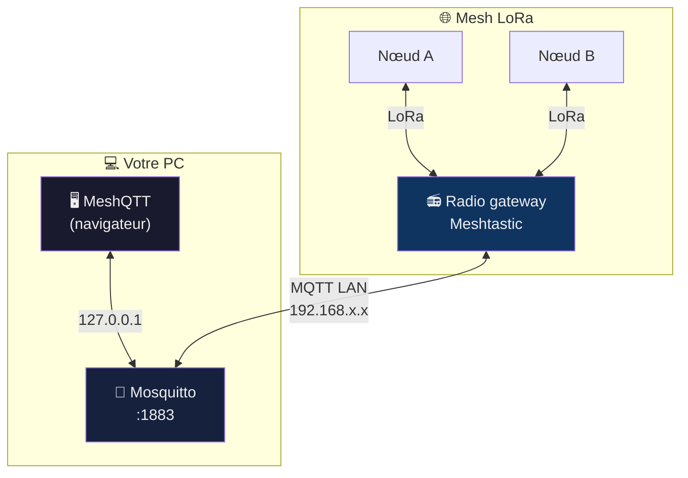
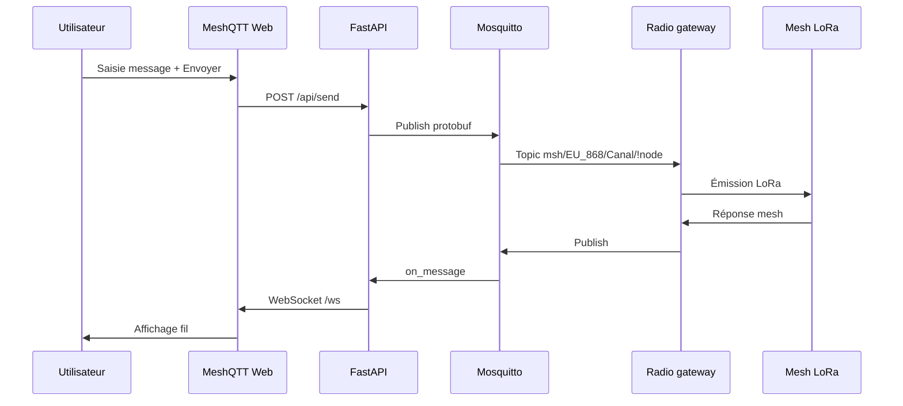
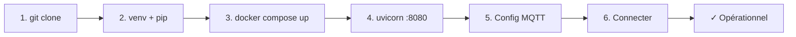

# MeshQTT

```
  ███╗   ███╗ ███████╗ ███████╗ ██╗  ██╗      ██████╗  ████████╗ ████████╗
  ████╗ ████║ ██╔════╝ ██╔════╝ ██║  ██║     ██╔═══██╗ ╚══██╔══╝ ╚══██╔══╝
  ██╔████╔██║ █████╗   ███████╗ ███████║     ██║   ██║    ██║       ██║
  ██║╚██╔╝██║ ██╔══╝   ╚════██║ ██╔══██║     ██║▄▄ ██║    ██║       ██║
  ██║ ╚═╝ ██║ ███████╗ ███████║ ██║  ██║     ╚██████╔╝    ██║       ██║
  ╚═╝     ╚═╝ ╚══════╝ ╚══════╝ ╚═╝  ╚═╝      ╚══▀▀═╝     ╚═╝       ╚═╝
        Client Meshtastic nodeless · Gestion de crise · MQTT · Web
```

[](https://www.python.org/)
[](https://fastapi.tiangolo.com/)
[](https://mosquitto.org/)
[](https://meshtastic.org/)
[](LICENSE)

> **Nodeless** = sans radio LoRa sur le PC. MeshQTT simule un nœud Meshtastic via MQTT, comme une gateway, depuis votre navigateur.

---

## En bref

| | |
|---|---|
| **Quoi** | Poste de commandement web pour réseau mesh Meshtastic |
| **Comment** | Pont MQTT protobuf (8 canaux, chiffrement PSK) |
| **Pour qui** | Secours, pompiers, gestion de crise |
| **Où** | [http://127.0.0.1:8080](http://127.0.0.1:8080) en local |

---

## Architecture réseau



### Qui se connecte où ?

```
┌─────────────────────────────────────────────────────────────────┐
│  MÊME BROKER Mosquitto — DEUX CLIENTS DIFFÉRENTS                │
├────────────────────────────┬────────────────────────────────────┤
│  MeshQTT (navigateur)      │  Radio Meshtastic (gateway)        │
├────────────────────────────┼────────────────────────────────────┤
│  Broker : 127.0.0.1        │  Broker : IP LAN du PC             │
│  Port   : 1883             │  Port   : 1883                     │
│  Topic  : msh/EU_868       │  Topic  : identique (Gaulix)       │
│  Auth   : (vide)           │  Auth   : (vide)                   │
└────────────────────────────┴────────────────────────────────────┘
         ⚠️  Ne pas mettre 127.0.0.1 sur la radio — c'est elle-même !
```

Guide détaillé : [docs/mqtt-gateway.md](docs/mqtt-gateway.md)

### Root topic — réseau Gaulix

| Paramètre | Valeur |
|-----------|--------|
| **Root topic** | **`msh/EU_868`** |
| **Bande** | **Même topic** en 433 ou 868 MHz (crossband via le serveur MQTT) |

Laisser la valeur par défaut côté radio si elle propose déjà `msh/EU_868`. **Identique** sur MeshQTT, la gateway et tout client du même mesh.

Exemples de topics :

- Abonnement : `msh/EU_868/Fr_Balise/#`
- Publication : `msh/EU_868/Fr_Balise/!a1b2c3d4`

> Ne pas confondre avec le broker public Meshtastic (`msh/EU_868/2/e/`…) — format différent. Les anciens topics (`msh/EU_868/2/e/`, `msh/EU/433/2/e/`) sont migrés automatiquement vers `msh/EU_868/` à l'enregistrement.

Détail des paramètres : [docs/configuration.md](docs/configuration.md)

---

## Interface (aperçu texte)

```
┌──────────────────────────────────────────────────────────────────────────────┐
│  MeshQTT          [Statut]  [Info Routes 42]  [Carte]  [MQTT] [Meshtastic]  │
│                                                      [Connecter] [Déconnecter]│
├──────────────┬───────────────────────────────────────────────┬───────────────┤
│ PRÉDÉFINIS   │  MESSAGES (fil temps réel WebSocket)          │  NŒUDS (42)   │
│              │                                               │               │
│ ▶ Pompier    │  [12:04] Fr_Balise : PARTI                   │  !a1b2c3d4    │
│ ▶ Secours    │  [12:05] D_Ligerien : renfort demandé         │  !e5f6g7h8    │
│ ▶ Crise      │  ...                                          │  ...          │
│              ├───────────────────────────────────────────────┤               │
│ [+ Nouveau]  │  CLAVIER — Groupe / Direct                    │               │
│              │  [Canal ▼] [Message...............] [Envoyer] │               │
│              ├───────────────────────────────────────────────┤               │
│              │  INFO ROUTES 42 (Internet) → remontée mesh    │               │
└──────────────┴───────────────────────────────────────────────┴───────────────┘
```

---

## Flux d'un message



---

## Origines

MeshQTT est une **adaptation web** de [**Connect**](https://github.com/pdxlocations/connect) (*A Nodeless MQTT Client for Meshtastic*) par [**pdxlocations**](https://github.com/pdxlocations).

```
  Connect (Python + Tkinter)          MeshQTT (ce dépôt)
  ─────────────────────────         ─────────────────────
  mqtt-connect.py                 →   app/mqtt_client.py + API REST
  Client desktop                  →   Serveur FastAPI + navigateur
  Carte folium optionnelle        →   Waypoints WAYPOINT_APP + Leaflet
  —                               →   Info Routes 42, prédéfinis, 8 canaux UI
```

| | |
|---|---|
| **Projet d’origine** | [github.com/pdxlocations/connect](https://github.com/pdxlocations/connect) |
| **Concept repris** | Pont MQTT Meshtastic sans nœud radio (protobuf, PSK) |
| **Écosystème** | [Meshtastic](https://meshtastic.org) · [meshtastic-mqtt-client](https://github.com/arankwende/meshtastic-mqtt-client) |

Détails : [docs/origines.md](docs/origines.md)

---

## Fonctionnalités

```
  ┌─────────────┐  ┌─────────────┐  ┌─────────────┐  ┌─────────────┐
  │   MQTT      │  │  MESSAGES   │  │   CANAUX    │  │ PRÉDÉFINIS  │
  │ multi-canal │  │ temps réel  │  │  0 → 7 PSK  │  │  rubriques  │
  └─────────────┘  └─────────────┘  └─────────────┘  └─────────────┘
  ┌─────────────┐  ┌─────────────┐  ┌─────────────┐  ┌─────────────┐
  │  CLAVIER    │  │ INFO ROUTE  │  │   CARTE     │  │   THÈME     │
  │ grp/direct  │  │ 42 + mesh   │  │  /map OSM   │  │  jour/nuit  │
  └─────────────┘  └─────────────┘  └─────────────┘  └─────────────┘
```

| Domaine | Description |
|---------|-------------|
| **MQTT** | Broker local ou distant, root topic Gaulix `msh/EU_868`, multi-canaux |
| **Messages** | Fil WebSocket, déchiffrement PSK |
| **Nœuds** | Liste des nœuds visibles sur le mesh |
| **Canaux** | 8 slots, rôles PRINCIPAL / SECONDAIRE / DESACTIVE |
| **Prédéfinis** | Pompier, Secours, Crise… → `data/presets.json` |
| **Info Routes 42** | Bulletin Loire, waypoints, remontée mesh |
| **Carte** | Leaflet sur `/map` |

---

## Démarrage rapide



### Prérequis

- Python **3.11+** · **Docker** · Navigateur moderne

### Installation

```powershell
git clone https://github.com/F4EED/MeshQTT.git
cd MeshQTT

python -m venv .venv
.\.venv\Scripts\pip install -r requirements.txt

docker compose up -d
.\.venv\Scripts\uvicorn app.main:app --host 127.0.0.1 --port 8080
```

→ Ouvrir **[http://127.0.0.1:8080](http://127.0.0.1:8080)**

### Checklist premier usage

```
  [ ] Mosquitto actif     →  docker ps --filter name=meshqtt-mosquitto
  [ ] MQTT configuré      →  127.0.0.1:1883 + root topic Gaulix : msh/EU_868
  [ ] Canaux Meshtastic   →  noms + clés PSK alignés avec la radio
  [ ] Connecter           →  bouton en haut à droite
  [ ] Radio gateway       →  module MQTT vers IP LAN du PC
  [ ] Nœuds visibles      →  colonne de droite
```

---

## Configuration

```
  data/settings.json  ──►  config embarquée (canaux, MQTT, UI)
         │
         ▼
  localStorage        ──►  copie navigateur (prioritaire si présente)
         │
         ▼
  /api/settings       ──►  sync serveur ↔ client
```

| Fichier | Rôle | Sur GitHub |
|---------|------|------------|
| `data/settings.json` | MQTT, canaux, identité | ❌ (gitignore — clés PSK) |
| `data/presets.json` | Messages prédéfinis | ✅ |
| `docker/mosquitto/` | Broker local | ✅ |

Documentation : [docs/configuration.md](docs/configuration.md)

---

## Stack technique

```
                    ┌──────────────────┐
                    │    Navigateur    │
                    │  HTML · CSS · JS │
                    └────────┬─────────┘
                             │ HTTP / WS
                    ┌────────▼─────────┐
                    │  FastAPI       │
                    │  uvicorn       │
                    ├────────────────┤
                    │ mqtt_client.py │◄── paho-mqtt · protobuf
                    │ mesh_crypto.py │◄── AES-CTR
                    │ inforoute42.py │◄── proxy HTTP
                    └────────┬─────────┘
                             │ MQTT :1883
                    ┌────────▼─────────┐
                    │ Mosquitto Docker │
                    └──────────────────┘
```

| Composant | Technologie |
|-----------|-------------|
| Backend | FastAPI, uvicorn |
| MQTT | paho-mqtt, protobuf Meshtastic |
| Crypto | AES-CTR |
| Frontend | HTML, CSS, JavaScript vanilla |
| Carte | Leaflet + OpenStreetMap |

---

## Documentation

| Document | Contenu |
|----------|---------|
| [docs/installation.md](docs/installation.md) | Installation détaillée |
| [docs/mqtt-gateway.md](docs/mqtt-gateway.md) | Brancher une radio Meshtastic |
| [docs/configuration.md](docs/configuration.md) | MQTT, canaux, settings |
| [docs/utilisation.md](docs/utilisation.md) | Interface web |
| [docs/inforoute42.md](docs/inforoute42.md) | Info Routes 42 |
| [docs/cartographie.md](docs/cartographie.md) | Carte Leaflet |
| [docs/depannage.md](docs/depannage.md) | Dépannage |
| [docs/architecture.md](docs/architecture.md) | API, protocole |
| [docs/origines.md](docs/origines.md) | Connect → MeshQTT |

---

## Crédits

- [**Connect**](https://github.com/pdxlocations/connect) — [pdxlocations](https://github.com/pdxlocations)
- [**Meshtastic**](https://meshtastic.org) — protocole et écosystème mesh

---

## Licence

MIT License — voir [LICENSE](LICENSE).  
Vérifiez aussi la licence de [Connect](https://github.com/pdxlocations/connect) pour le code d’origine.
