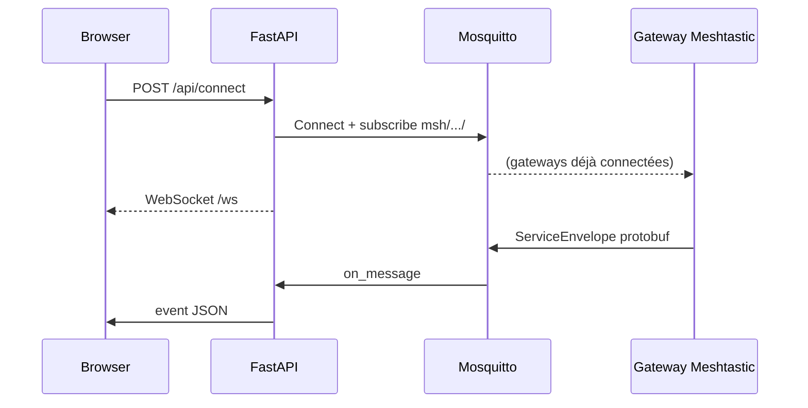

# Architecture

> **Origine** : adaptation de [Connect](https://github.com/pdxlocations/connect) par [pdxlocations](https://github.com/pdxlocations). Voir [origines.md](origines.md).

## Arborescence

```
MeshQTT/
├── app/
│   ├── main.py           # FastAPI, routes API, WebSocket
│   ├── mqtt_client.py    # Client MQTT nodeless Meshtastic
│   ├── mesh_crypto.py    # Chiffrement AES-CTR canaux
│   ├── settings.py       # settings.json, normalisation canaux
│   ├── inforoute42.py    # Proxy Info Routes 42
│   ├── constants.py      # Limite 200 octets UTF-8
│   └── static/           # Frontend SPA-like
├── data/settings.json    # Config persistée
├── docker/               # Mosquitto
├── docs/                 # Documentation
└── requirements.txt
```

## Flux de connexion



## API REST

| Méthode | Route | Description |
|---------|-------|-------------|
| GET | `/api/settings` | Lire config |
| PUT | `/api/settings` | Mettre à jour config |
| GET | `/api/status` | État connexion |
| GET | `/api/nodes` | Nœuds connus |
| GET | `/api/positions` | Dernières positions Meshtastic (mémoire serveur) |
| GET | `/api/mqtt/health` | Santé connexion MQTT (rx_count, last_topic) |
| GET | `/api/mqtt/downlink-debug` | État downlink par canal (gateway, topics, index) |
| POST | `/api/connect` | Connecter MQTT |
| POST | `/api/disconnect` | Déconnecter |
| POST | `/api/send` | Message texte |
| POST | `/api/waypoint` | Repère carte |
| GET | `/api/inforoute42` | Bulletin + signalements |
| GET | `/map` | Page carte Leaflet |
| WS | `/ws` | Événements temps réel |

### POST /api/send

```json
{ "text": "...", "channel": 3, "to": null }
```

| Champ | Broadcast (groupe) | Direct (DM) |
|-------|-------------------|-------------|
| `channel` | Index 0–7 du canal mesh | **0** (canal primaire Fr_Balise) |
| `to` | `null` ou omis | `node_id` décimal du destinataire |

### POST /api/waypoint

```json
{
  "latitude": 45.73,
  "longitude": 3.84,
  "name": "Titre",
  "description": "...",
  "channel": 0,
  "expire": null,
  "icon": 128205
}
```

## Protocole Meshtastic — réception (uplink)

1. Abonnement wildcards `{root}/2/json/#` et `{root}/2/e/#`
2. Décodage JSON ou `mqtt_pb2.ServiceEnvelope` protobuf
3. Déchiffrement PSK si canal chiffré
4. Diffusion WebSocket (`message`, `node`, `activity`)

Topics uplink courants :

| Type | Topic (ex.) |
|------|-------------|
| Canal mesh | `msh/EU_868/2/json/D_Ligerien/!ba69d0fc` |
| Message direct (PKI) | `msh/EU_868/2/json/PKI/!ba69d0fc` |
| Protobuf | `msh/EU_868/2/e/{canal}/!gateway` |

## Protocole Meshtastic — envoi (downlink)

MeshQTT n’a pas de radio : il publie sur MQTT ; une **gateway WiFi** relaie vers le mesh LoRa.

### Broadcast (groupe)

Deux publications en parallèle (`app/mqtt_client.py`) :

1. **JSON sendtext** (recommandé) → `msh/EU_868/2/json/mqtt`  
   `{"from": <id décimal gateway>, "type": "sendtext", "payload": "…", "channel": <index>}`
2. **Protobuf decoded** → `msh/EU_868/2/e/{canal}/!gateway`  
   `gateway_id` enveloppe = nœud **virtuel** MeshQTT (anti-boucle firmware)

Le champ `from` JSON doit être l’ID **decimal** de la gateway WiFi (`gateway_id` dans settings), pas le nœud virtuel MeshQTT.

### Direct (DM, Meshtastic 2.5+)

- **JSON sendtext uniquement** → `…/2/json/mqtt` avec `to`, `hopLimit`, sans `channel`
- Chiffrement **PKI** côté firmware gateway → mesh
- **Pas de protobuf** sur `Fr_Balise` (canal 0)
- Prérequis : nodeinfo / clés PKI échangées entre gateway et destinataire

### Prérequis gateway

| Réglage | Rôle |
|---------|------|
| Module MQTT → JSON enabled | Uplink JSON + réception sendtext |
| Canal radio **6** nommé `mqtt`, downlink ON | Réception commandes sur `…/2/json/mqtt` |
| Downlink ON sur chaque canal cible | Relay protobuf (broadcast) |
| `gateway_id` dans settings | Downlink même sans uplink récent |

Scripts de test : `scripts/mqtt_sendtext_test.py`, `scripts/mqtt_protobuf_downlink_test.py`.

## Protocole Meshtastic (waypoint / nodeinfo)

1. Construire `mesh_pb2.Data` (portnum + payload)
2. Encapsuler dans `MeshPacket` (from, to, id, hop_limit)
3. Chiffrer si clé canal présente (broadcast protobuf)
4. Publier `mqtt_pb2.ServiceEnvelope` sur `{root}/2/e/{canal}/!gateway`

| Port | Usage MeshQTT |
|------|----------------|
| `TEXT_MESSAGE_APP` | Messages texte |
| `WAYPOINT_APP` | Repères carte |
| `NODEINFO_APP` | Annonce à la connexion (désactivée par défaut au boot) |

## Frontend

- Pas de framework ; état global dans `app.js`
- `localStorage` : settings, prédéfinis, rubriques, thème
- WebSocket : messages, nœuds, statut, erreurs

## Info Routes — pipeline

1. `fetch_inforoute42_bulletin()` : HTML + XML repere/barreau
2. `_geo_fields()` : lat/lon + transform xy
3. JSON → frontend → render + envoi mesh

## Évolutions documentées

Tenir à jour `docs/` et ce fichier lors de l’ajout de routes, ports protobuf ou zones UI.
