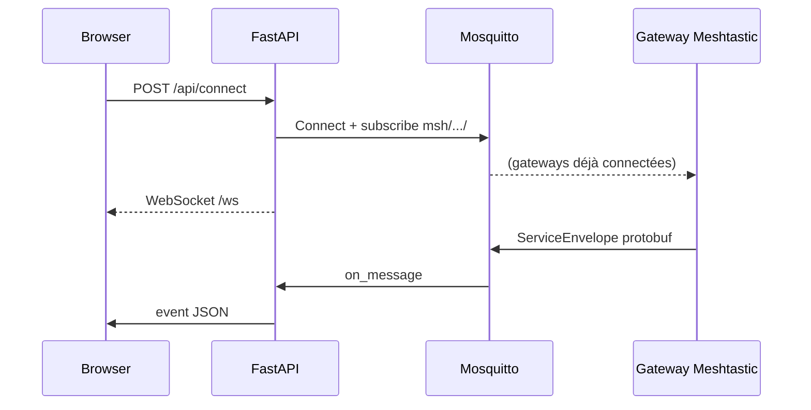

# Architecture

> **Origine** : adaptation de [Connect](https://github.com/pdxlocations/connect) par [pdxlocations](https://github.com/pdxlocations). Voir [origines.md](origines.md).

## Arborescence

```
MeshQTT/
├── app/
│   ├── main.py           # FastAPI, routes API, WebSocket
│   ├── mqtt_client.py    # Client MQTT nodeless Meshtastic
│   ├── mesh_crypto.py    # Chiffrement AES-CTR canaux
│   ├── settings.py       # settings.json, normalisation canaux
│   ├── inforoute42.py    # Proxy Info Routes 42
│   ├── constants.py      # Limite 200 octets UTF-8
│   └── static/           # Frontend SPA-like
├── data/settings.json    # Config persistée
├── docker/               # Mosquitto
├── docs/                 # Documentation
└── requirements.txt
```

## Flux de connexion



## API REST

| Méthode | Route | Description |
|---------|-------|-------------|
| GET | `/api/settings` | Lire config |
| PUT | `/api/settings` | Mettre à jour config |
| GET | `/api/status` | État connexion |
| GET | `/api/nodes` | Nœuds connus |
| GET | `/api/positions` | Dernières positions Meshtastic (mémoire serveur) |
| POST | `/api/connect` | Connecter MQTT |
| POST | `/api/disconnect` | Déconnecter |
| POST | `/api/send` | Message texte |
| POST | `/api/waypoint` | Repère carte |
| GET | `/api/inforoute42` | Bulletin + signalements |
| GET | `/map` | Page carte Leaflet |
| WS | `/ws` | Événements temps réel |

### POST /api/send

```json
{ "text": "...", "channel": 4, "to": null }
```

`to` = node_id pour direct ; omit pour broadcast.

### POST /api/waypoint

```json
{
  "latitude": 45.73,
  "longitude": 3.84,
  "name": "Titre",
  "description": "...",
  "channel": 0,
  "expire": null,
  "icon": 128205
}
```

## Protocole Meshtastic (envoi)

1. Construire `mesh_pb2.Data` (portnum + payload)
2. Encapsuler dans `MeshPacket` (from, to, id, hop_limit)
3. Chiffrer si clé canal présente
4. Publier `mqtt_pb2.ServiceEnvelope` sur `{root}{channel}/{node}`

| Port | Usage MeshQTT |
|------|----------------|
| `TEXT_MESSAGE_APP` | Messages texte |
| `WAYPOINT_APP` | Repères carte |
| `NODEINFO_APP` | Annonce à la connexion |

## Frontend

- Pas de framework ; état global dans `app.js`
- `localStorage` : settings, prédéfinis, rubriques, thème
- WebSocket : messages, nœuds, statut, erreurs

## Info Routes — pipeline

1. `fetch_inforoute42_bulletin()` : HTML + XML repere/barreau
2. `_geo_fields()` : lat/lon + transform xy
3. JSON → frontend → render + envoi mesh

## Évolutions documentées

Tenir à jour `docs/` et ce fichier lors de l’ajout de routes, ports protobuf ou zones UI.
